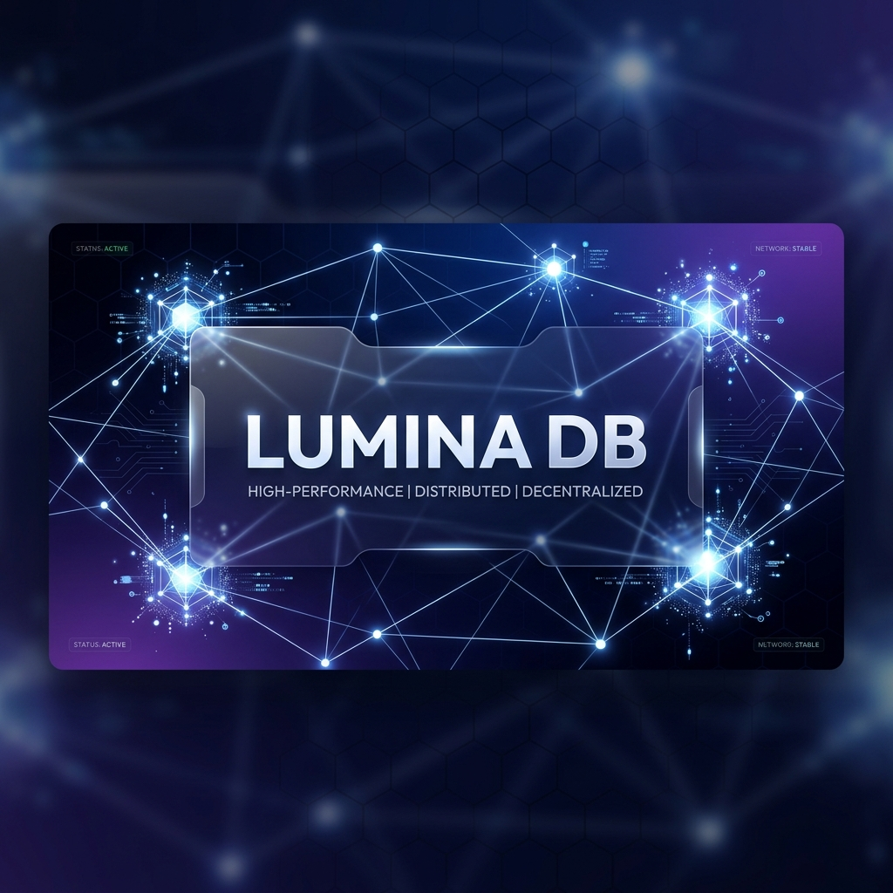
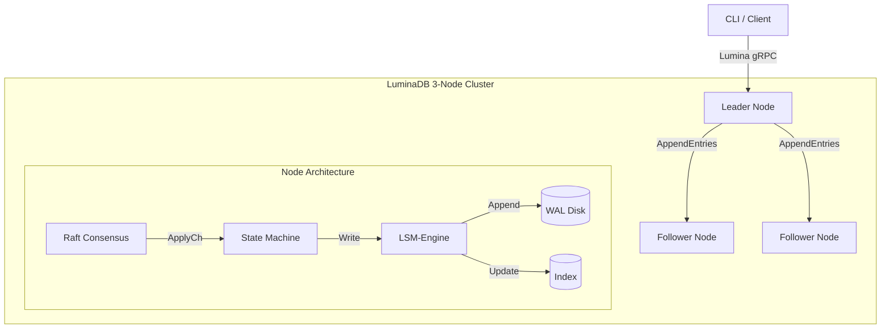

<p align="center">
  
</p>

# LuminaDB

<p align="center">
  
  
  
  
</p>

LuminaDB is a fault-tolerant, high-performance distributed key-value store built from the ground up in Go. It implements the **Raft consensus algorithm** to provide strong consistency and durability across a cluster of nodes.

---

## Key Features

- **Distributed Consensus**: Custom implementation of the **Raft** algorithm for leader election and log replication.
- **Durable Storage**: Log-structured storage engine with a **Write-Ahead Log (WAL)** and an in-memory index for O(1) performance.
- **gRPC Architecture**: Efficient node-to-node and client-to-server communication using Protobuf 3.
- **Fault Tolerance**: Maintains availability and consistency even if a minority of nodes fail.
- **Dockerized**: Easy deployment of a 3-node cluster using Docker Compose.
- **Benchmarking Tool**: Built-in tool to measure throughput and latency.

## Architecture

LuminaDB is built as a multi-layered system designed for high availability and low latency.



### Core Components

1. **Storage Engine**: A log-structured engine that appends all mutations to a **Write-Ahead Log (WAL)**. Every write is `fsync`'d before acknowledgement to ensure **ACID** guarantees.
2. **Consensus (Raft)**: Custom implementation of the Raft protocol. Includes **Leader Election**, **Log Replication**, and **Safety** guarantees even during network partitions.
3. **gRPC Framework**: Protocol Buffers defined in `proto/` ensure efficient serialization and a clear contract for cluster internal and external operations.

## Getting Started

### Prerequisites

- Go 1.21+
- Docker & Docker Compose

### Running the Cluster

To spin up a 3-node fault-tolerant cluster:

```bash
docker-compose up --build
```

Nodes will be available on:
- Node 1: `localhost:50051`
- Node 2: `localhost:50052`
- Node 3: `localhost:50053`

### Using the CLI

You can interact with the database using the provided CLI tool:

```bash
# Writing a value
go run cmd/lumina-cli/main.go -addr localhost:50051 put mykey myvalue

# Reading a value
go run cmd/lumina-cli/main.go -addr localhost:50051 get mykey
```

### Benchmarking

To test the performance of the cluster:

```bash
go run cmd/bench/main.go -addr localhost:50051 -c 20 -n 500
```

## Why LuminaDB?

This project was built to showcase:
- **Concurrency in Go**: Extensive use of goroutines, channels, and mutexes for the Raft state machine.
- **Distributed Systems Design**: Understanding of CAP theorem trade-offs and consistency models.
- **Systems Programming**: Low-level binary encoding and file I/O for the storage engine.
- **API Design**: Clean gRPC service definitions and client-facing interfaces.
